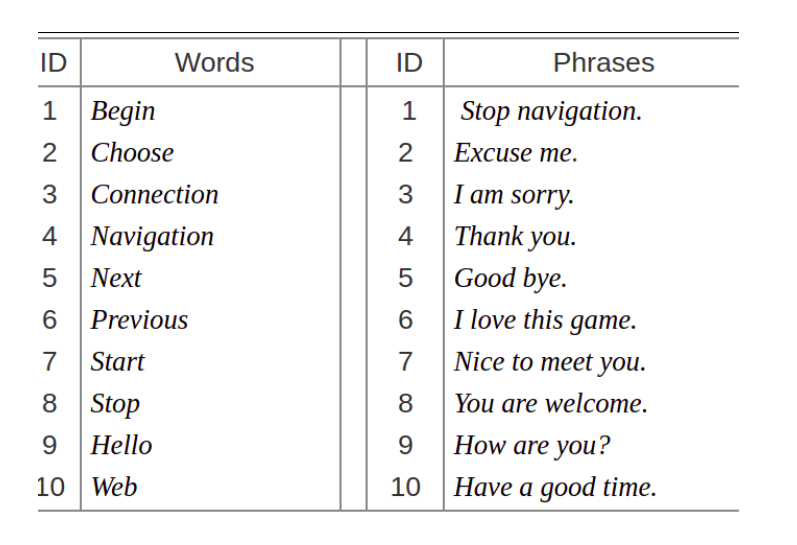
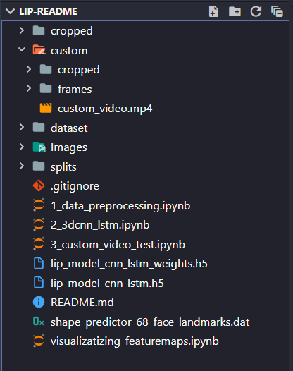
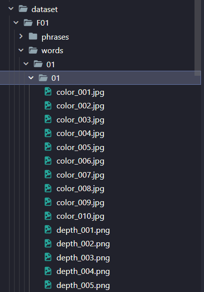
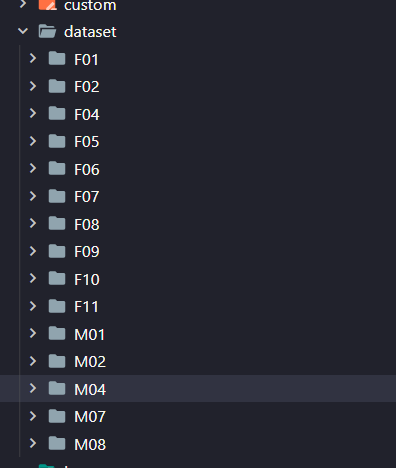
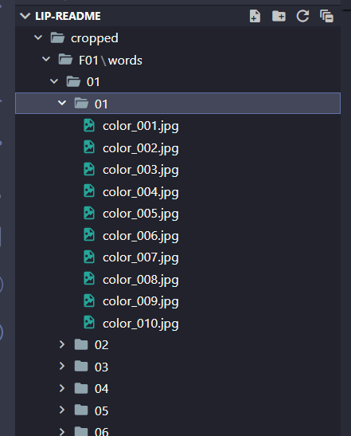
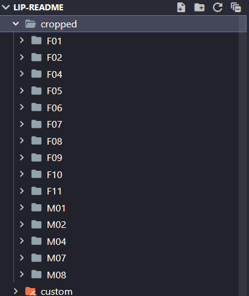

# Lip-README
* Lip-README gives predicted spoken word as text as output by speech detected by using only lip movements from a video as input using Deep Learning.
* Convolutional neural network (CNN) and Long short-term memory (LSTM) models are used to apply deep learning techniques to generate speech from silent lip movements.

## Installation & Running 
Clone the project:
```
git clone https://github.com/Pranav122002/Lip-README.git
```
Go to project folder:
```
cd .\Lip-README\
```
Install requirements:
```
pip install numpy pandas imutils dlib opencv-python tensorflow imageio matplotlib
```
or
```
pip install -r requirements.txt
```
Download Miracle-vc1 dataset from:
```
https://sites.google.com/site/achrafbenhamadou/-datasets/miracl-vc1
```
Download dataset folder and shape_predictor_68_face_landmarks.dat file and place both in main project folder


## Folder structure 







## Demo video


https://user-images.githubusercontent.com/83356594/235310594-5aa17c6b-b0b1-48bf-aff7-c9e234e98ff3.mp4


## Tools used
* Python
* Tensorflow
* OpenCV
* Jupyter Notebook
* Streamlit


